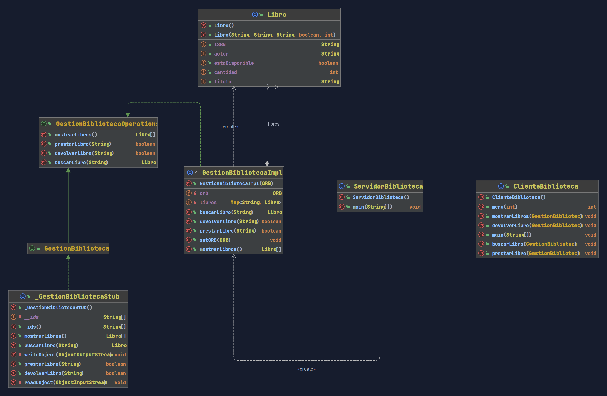

# Biblioteca CORBA

Este proyecto implementa un sistema de gestión de biblioteca utilizando la Arquitectura de Corredor de Objetos Comunes 
(CORBA), permitiendo la interacción entre un cliente y un servidor para gestionar libros.

## Prerrequisitos

Para ejecutar este proyecto necesitas tener instalado:

- Java Development Kit (JDK) versión Amazon Corretto 1.8.
- Un ORB compatible con CORBA para Java, como el incluido en el JDK.


## Compilación y Ejecución

### Compilación

Primero, compila los archivos IDL para generar los stubs y esqueletos necesarios para CORBA (genera la carpeta 
[Biblioteca](src/Biblioteca)):

```bash
idlj -fall Biblioteca.idl
```
Luego, compila los archivos .java del servidor y el cliente:

```bash
javac ServidorBiblioteca.java
javac ClienteBiblioteca.java
```

### Levantamiento del Servidor y Cliente
Inicia el servicio de nombres de CORBA en el puerto 1050:
   
```bash
tnameserv -ORBInitialPort 1050
```

En una nueva terminal, inicia el servidor de la biblioteca:

```bash
java ServidorBiblioteca -ORBInitialHost localhost -ORBInitialPort 1050
```

En otra terminal, inicia el cliente de la biblioteca:

```bash
java ClienteBiblioteca -ORBInitialHost localhost -ORBInitialPort 1050
```

## Funcionalidades del Cliente
El cliente de la biblioteca ofrece las siguientes funcionalidades a través de un menú interactivo:

- **Buscar Libro:** Permite buscar un libro por su título.
- **Solicitar Préstamo:** Posibilita pedir el préstamo de un libro utilizando su ISBN.
- **Devolver Libro:** Facilita la devolución de un libro prestado.
- **Mostrar Libros Disponibles:** Muestra todos los libros disponibles para préstamo en la biblioteca.

Cada opción es accesible a través de un menú al iniciar el cliente.

## Diagrama de Clases
El diagrama UML muestra como la interfaz GestionBiblioteca gestiona operaciones como la búsqueda y préstamo de libros,
mientras que GestionBibliotecaImpl maneja la lógica del servidor y ClienteBiblioteca se encarga de las interacciones 
del usuario.




